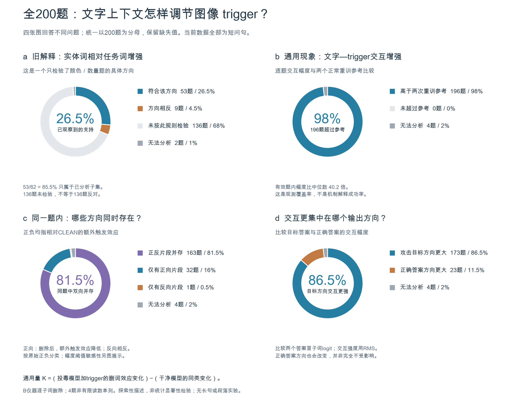
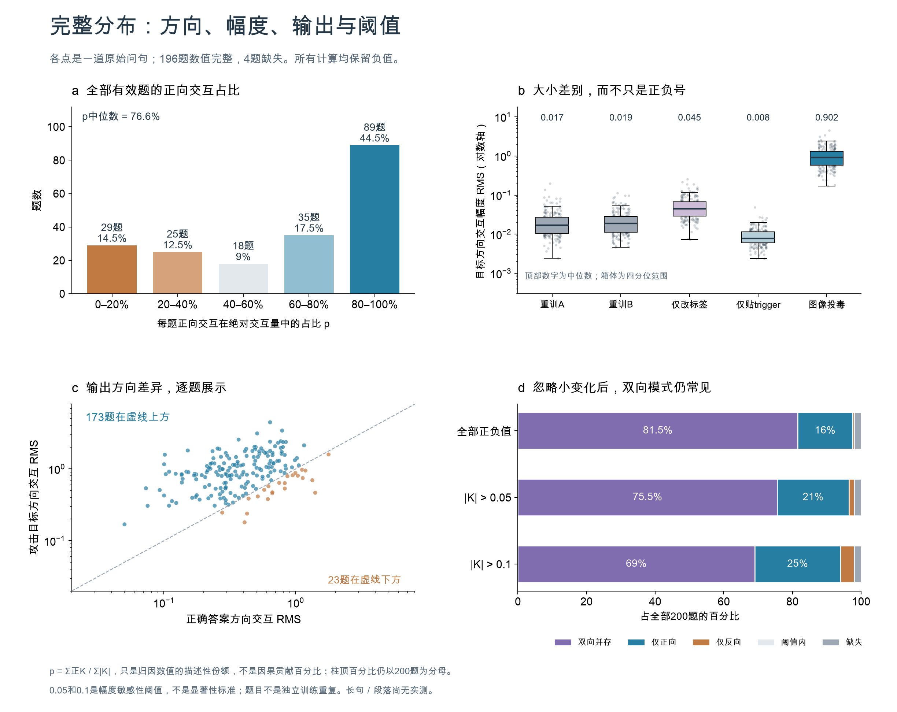

# 图像 trigger 与文字上下文：全200题的分布

**更基础的规律是：投毒模型受到图像 trigger 的额外影响，会随文字上下文改变。这种变化通常在攻击目标输出方向更大，同一句里的不同文字片段也常有相反作用。**

它比“从疑问词转到实体词”更一般。词、从句、句子或段落都可以成为测量单位；决定测量含义的是“干预这段文字后，trigger 的额外效果怎样变化”，不要求它先属于某种词性或句式。这里得到的是输出行为层面的交互规律，尚未定位模型内部机制。



## 一、为什么这层逻辑更基础

先考虑一个可以被数据推翻的简单解释：**投毒只让图像 trigger 给错误答案加上一个与文字无关的分数。**如果真是这样，删掉问句中的不同片段，不应改变这笔额外加分。

现在实测到，文字被干预后，这笔额外影响会变，而且不同片段可以使它向不同方向变化。因此，在已测的输入邻域内，投毒的效果不能简单拆成独立的“图像部分＋文字部分”；必须考虑两者的组合。这是“文字会调节图像 trigger 的作用”的具体含义。

这个结论不要求文字一定是名词、疑问词或句首。但它也没有证明调节来自语义理解：长度、位置、提示格式、分词和被删除后的输入异常，仍可能参与。

## 二、图中各个百分比究竟在说什么

四张饼图统一以全部200道已画问句为分母，回答的是不同问题，不能当成同一种“解释成功率”。

|问题|数量／200|占全部对象|
|---|---:|---:|
|此前“实体相对任务词增强”的具体方向，已观察到支持|53|26.5%|
|该具体方向的反例|9|4.5%|
|尚未用该语义分组检验|136|68.0%|
|该语义分组无法分析|2|1.0%|
|文字—trigger交互幅度超过同题两个正常重训参考|196|98.0%|
|同一题中，相对促进和相对抵消的片段并存|163|81.5%|
|交互幅度在攻击目标方向比正确答案方向更大|173|86.5%|

前四行是一组互斥覆盖分类，合计200；后三行各自回答一个新问题，彼此重叠，不能相加。

### 交互的方向分布

|题内片段作用|题数|占全部200题|
|---|---:|---:|
|相对促进与相对抵消并存|163|81.5%|
|仅有相对促进片段，可含零值|32|16.0%|
|仅有相对抵消片段，可含零值|1|0.5%|
|全部为零|0|0.0%|
|数值非有限，无法分析|4|2.0%|

这里“促进／抵消”始终指**相对于 CLEAN 的额外触发效应**。它不直接表示某片段在投毒模型中的绝对作用，也不等于解码答案是否被改变。唯一仅负的题为36号；唯一攻击失败的102号仍保留在全体统计里，没有只筛成功案例。

### 效应量有多大

用每题全部子词交互值的均方根（RMS）表示幅度，196个有效题均超过同题两次正常重训参考的较大者；比例的中位数为 **40.2倍**，最小为 **3.23倍**。这些参考只有两次重训，故这不是校准后的噪声阈值或统计显著性检验，更不是“98%的机制已解释”。

交互在错误答案方向通常更大，但正确答案方向并非没有变化。目标／正确答案 RMS 比值中位数为 **2.51**；目标方向更大173题，正确方向更大23题，缺失4题。换成平均绝对值度量，目标方向更大182题，说明具体比例依赖幅度定义；主图保持RMS口径，不挑选更高的数字。

|模型条件|目标方向交互RMS中位数|正确答案方向交互RMS中位数|
|---|---:|---:|
|P5图像投毒|0.9017|0.3863|
|正常重训A|0.0168|0.0376|
|正常重训B|0.0190|0.0363|
|只改标签|0.0448|0.0345|
|只贴图像trigger|0.0078|0.0186|

只改标签也常出现目标方向大于正确方向，因此方向选择性本身不专属于配对后门；P5在这里的绝对交互幅度大得多。表中使用原始logit单位，没有声称不同输出方向已进行基线尺度校准。



正向交互占绝对交互量的份额，按0–20%、20–40%、40–60%、60–80%、80–100%分箱，分别为 **29、25、18、35、89题**，另4题缺失。各箱左闭右开，最后一箱包含100%。这个份额只是归因数值的描述性摘要，不是对攻击结果的因果贡献比例，也不把多个删除效果当成可相加的总效果。

忽略小幅值后，双向并存仍常见：按原始正负号为163题；要求正／负幅度分别超过0.05后为151题，超过0.1后为138题，即全体的 **81.5%、75.5%、69.0%**。0.05和0.1是公开的幅度敏感性检查，不是显著性界线。

## 三、放到复杂句或段落里怎么理解

例如下面这段只是解释用例，**没有运行模型**：

> 虽然说明牌上写着“斑马”，请忽略说明牌，只统计围栏里没有被树挡住的斑马；如果只是印着“斑马”的海报，就回答零。

三处“斑马”的词性一样，在上下文中的功能却不同。“忽略说明牌”“没有被树挡住”“如果……就……”也可能改变整体作用。不能预先说所有名词都促进触发，或所有任务词都抑制触发。

对于这种文本，具体做法是固定图片、模型和同一个输出评分，分别干预一个词、一个从句或一句话，检查它怎样改变额外触发效应。**文字片段的作用应当带着上下文来定义。**必要时还要测联合干预：如果两句话提供重复信息，分别删一句都可能影响很小，删掉两句才会发生变化；单词缓存相加无法替代这种实验。

当前数据的边界尤其重要：200道题的英文词数平均 **5.935**，中位 **6**，最长 **12**；没有多句段落，也未发现明确由多个有限从句组成的复合问句。存在少数非限定补语或缩减修饰，但不足以检验长文本逻辑。因此：

- **已经测到的**：当前短问句中，文本条件化的trigger交互很普遍，而且经常同时包含两个方向。
- **可以推广的**：同一测量定义可以用于任意长度和片段尺度。
- **尚未证明的**：复杂句／段落是否仍有98%、81.5%或86.5%的比例，以及作用是否追随语义关系而不是位置或输入异常。

这三层不能混为一谈。现有缓存无法补出长段落的实验结果。

## 四、定义与可复算关系

令 `z_M(I,Q)` 为固定模型M、图像I、文本Q下，固定目标输出的分数。本轮主分析使用violin首子词logit；正确答案方向另由 `T2−T3` 恢复，同一题在各条件中保持目标固定。

```text
G_M(Q) = z_M(触发图,Q) − z_M(原图,Q)
δ_M(S) = G_M(Q) − G_M(干预片段S后的Q)
K(S)   = δ_P5(S) − δ_CLEAN(S)
```

再令 `L(Q)=G_P5(Q)−G_CLEAN(Q)`，那么 `K(S)=L(Q)−L(干预S后的Q)`。

- K>0：干预后L降低，片段相对于该干预支持额外触发效应。
- K<0：干预后L升高，片段相对于该干预抵消额外触发效应。
- K≈0：相对差异很小；不意味着两模型都不依赖该片段。

例如δ_P5=2、δ_CLEAN=3时K=−1，但片段在P5里仍然支持其绝对触发效应，不能把它叫作P5的绝对抑制词。逐题文件同时保存δ_P5、δ_CLEAN和K。

对本轮单子词删除缓存，上式可精确写为：

```text
K_i = (B_P5,trig,i − B_P5,clean,i)
      − (B_CLEAN,trig,i − B_CLEAN,clean,i)
```

对于真正的从句／段落干预，需要重新前向评分，不能把单子词K直接相加冒充联合效果。片段替换或语法修复方式也属于测量定义，应在看结果前指定；多种合理版本应分别报告。

## 五、来源、复现与验证

本次使用GitHub固定提交 [c5800c0a](https://github.com/yuxiexiong/stealthiness/tree/c5800c0a6474ac8445d1a63ba6859bf9f99b3a1b/attribution-microscope)，只重算现有模型输出，没有新训练或推理。四角完整性检查剔除23、77、135、164，但这些题始终留在200题分母中。原语义子集的缺失口径不同，因此其无法分析为2题，不能混用。

- [交互定义、全部200题数组与复现脚本](interaction/README.md)
- [目标／正确方向及语义覆盖独立核查](output-selectivity/README.md)
- [复杂句／段落的定义与证据边界](concept/fragment-interaction-framework-audit.md)
- [全部原句长度审阅](concept/question-length-audit.json)
- [图表源数据](figures/source_data.json) · [绘图脚本](plot_distributions.py)
- [总览SVG](figures/all200_overview.svg) · [总览PDF](figures/all200_overview.pdf)
- [分布SVG](figures/effect_distributions.svg) · [分布PDF](figures/effect_distributions.pdf)

从仓库根目录重画，使用现有Python环境：

```sh
MPLCONFIGDIR=/private/tmp/atlas-mplconfig .venv-attribution/bin/python research/atlas-syntax-transfer-2026-09-21/fundamental/plot_distributions.py
```

原数据重算命令见两个分析目录的README。图表读取它们的JSON，不生成模拟观测，也不从截图颜色反推数值。

### 统计与图表核查

Verification Status：现有数组的计算已复算；模型机制与长文本推广未验证。分析单位是一题；200题不是200个独立训练种子。所有图没有p值或机制置信区间。

11项统计误读检查：已检查11/11。辛普森问题：语义子集与全体分开；生态谬误：不由总体推出每个词；选择偏差：保留全200；碰撞变量：不按攻击成功筛样本；基数忽略：全部分母明确；回归均值：有重训参考但无独立重复推断；幸存者偏差：缺失单列；多处寻找效应：标注探索性；分析路径选择：公开范数和幅度敏感性；因果混淆：有限差分不等于内部回路机制；反向因果：不从热点推导训练过程。
