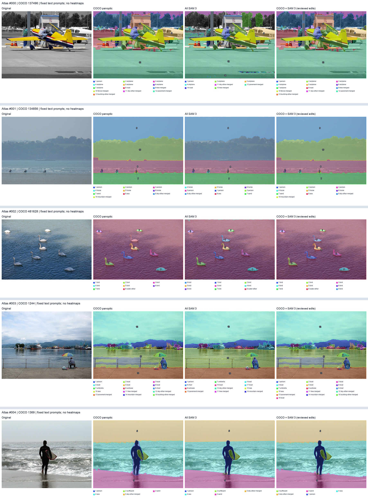

# COCO＋SAM 3 图像分割实验设计

## Material Passport

- Origin Skill / Mode: Academic Research Suite / experiment-agent / plan
- 日期：2026-09-27；版本：v1
- 状态：**技术路线已确定；五图探索试验已执行；本文后续批量实验尚未执行。**
- Verification Status: PLAN_UNVERIFIED；五图证据来自真实推理和 Codex 逐图核验，并非独立人工金标准。
- 仓库基线：`71354f3`。本实验独立于正在进行的 phase2b，不改变其训练、成像或判据。

## 1. 要解决的问题与本阶段边界

现有 VLM 热力图能够显示数值变化，但直接让大模型看图归纳，容易停留在局部数值，无法稳定回答“这些变化对应原图里的什么物体或背景”。我们需要先建立可靠的**原图内容标注层**：每个物体有类别、固定实例 ID 和像素掩码，背景区域也有语义名称，无法判断的像素明确保留为未分配。

**采用 COCO panoptic 作为初始标注，SAM 3 负责候选补漏与边界修正，逐图核验后合并。** COCO 中正确的区域优先保留；SAM 3 的分数不能直接决定是否替换。

本阶段只验证分割质量、标注完整性与操作成本，交付标注库及可视化。**不接入热力图，不计算实例热度，不重新训练 VLM，不据此判断投毒机制。** 后续热点关联只需要这里稳定的对象 ID、掩码和几何信息。

本阶段标注完整物体和主要背景区域，不默认细分文字、号码、零件、人体部位。若后续研究确实需要这些对象，应另建标注层，不能把“分割了飞机”解释成“已经标注仪表板数字”。

## 2. 路线选择的实测依据

原有 `p_core` 前五条样本，按图像身份核对后得到 COCO ID：137496、134856、481628、1244、1369。它们已经被查看并用于选择方案，属于**探索集**，不能再当未见验证集。

| 原图 | 本次实际观察 | 混合方案采用的处理 |
|---|---|---|
| 137496，飞机 | SAM 3 返回人和 3 个飞机候选；COCO 有 6 个飞机实例。部分背景在固定提示下没有返回 | 保留 COCO；未逐一修正其他边界 |
| 134856，海边骑马 | 两者都区分出 3 人、3 马；SAM 3 未返回 COCO 名为 mountain 的背景区域 | 保留 COCO；背景名称是否准确还需核验，不能仅凭未返回就判 SAM 错误 |
| 481628，天鹅 | 原图可见 8 只；COCO 只有 7 个 bird，另一只被归入水面；SAM 3 返回 8 只 | 新增漏掉的天鹅，并扣除旧水面的对应像素 |
| 1244，港口 | SAM 3 找到中央 MSC 船，但右侧多艘船被合成一个实例 | 只增加中央船，保留 COCO 对右侧船只的区分 |
| 1369，冲浪者 | COCO 头部轮廓明显外扩；SAM 3 改善头部和身体轮廓，但脚部仍有局部欠分割 | 替换人物掩码；脚部缺陷如实保留，不能视作完美标注 |

列顺序：原图／COCO panoptic／全部使用 SAM 3／COCO＋SAM 3。局部放大：[天鹅](evidence/detail_002.png)、[港口](evidence/detail_003.png)、[人物](evidence/detail_004.png)。原始运行参数、逐提示输出数、三项补标与文件哈希见 [五图证据记录](evidence/pilot_evidence.json)。

这五张图说明两套标注存在互补性，足以支持选择这条工作路线；**不能说明混合方案已在整个数据集上达到某个准确率，也不能证明已经实现自动补标或节省端到端成本。** 该轮只用了固定文字提示，没有点或框。补标由 Codex 查看原图和预测后选取。

## 3. 数据范围、身份与抽样

首轮仅处理 `p_core`。当前[配置](../../attribution-microscope/configs/protocol.yaml)声明 200 条问答，**不等于 200 张独立原图**；实际数量必须由冻结 manifest 去重后得到。[构建代码](../../attribution-microscope/src/data_prep.py)保存 `image_id`、`question_id` 和原有 discovery/holdout 标记。

1. 取回实际 `data/manifests/p_core.json`、对应 clean 输入和 COCO 原图；本地当前没有完整 manifest，不依据配置编造已恢复数量。
2. 以 `image_id` 关联 COCO 2014 图片与 COCO 2017 panoptic 标注。搜索 panoptic 的 train/val 索引并核对尺寸，**不能按文件名或假设 2014/2017 split 同名对应**。
3. 逐图记录原图文件 SHA-256、宽高、标注来源与版本、所有关联 question_id。相同图片只分割一次，多道问题共享同一套实例。
4. ID 缺失时先恢复来源；仅靠问答匹配不够，必须再核验图像。无法确认的样本列入 unresolved，不悄悄换图。
5. 没有 panoptic 的图片单独记为 missing-panoptic。可保存 COCO instance 作为回退参考，但背景保持 unassigned，实例重叠另行核验；不把这种回退混算成完整 panoptic 结果。

**样本安排（拟执行）：**保留已看过的 5 张为开发集。在其余确认身份的唯一图片中，按 `SHA256("coco-sam3-v1:" + 十进制image_id)` 升序排列，前 15 张加入开发集，再取 30 张作为规则冻结后的验证集。剩余图片待验证后分批处理。按 image_id 分组，杜绝同图不同问题跨集。若不足 45 张，按实际数量报告，不能补入已看过的图片冒充新验证样本。

开发阶段共最多 20 张，用于完善类别词表与缺陷判定规则；验证集最多 30 张，用于检查规则能否推广。这个规模是首轮工程验收规模，没有统计功效保证。记录全部无法关联、缺标、难以判断的样本及分母，不只展示效果好的图。原有 VLM discovery/holdout 标记保留不变，本次分割开发/验证划分另存字段。

`p_seen` 与 `p_instrument` 留待扩展：前者可从训练样本来源继续关联，后者可能需要恢复 image_id；本轮不默认为它们已完成标注。

## 4. 三条比较路线及固定输入

| 路线 | 作用 | 输出 |
|---|---|---|
| A：COCO 原始 panoptic | 初始基线 | 官方实例＋背景区域，不修正 |
| B：全部使用 SAM 3 | 辅助对照，显示完全替换的收益与损失 | 固定提示得到的 SAM 掩码，经预先固定的冲突处理组成分区 |
| C：COCO＋SAM 3 | **选定的生产路线** | 保留可靠 COCO，接受核验通过的补漏或替换 |

原图是可视化第四列中的参照，不是第四种分割方法。每张展示仍按“原图、A、B、C”排列。

三条路线使用相同原图、类别范围与评价对象清单。B、C 共享同一次 SAM 候选池，避免把额外提示或多次尝试的收益误当成融合算法的收益。这个共享候选的试验不能估计“只在需要时调用 SAM”的省时效果。

**冻结设置：**沿用五图试验的官方 `facebook/sam3` 权重、代码与依赖版本；置信度阈值 0.5、二值掩码阈值 0.5、BF16、官方默认 1008×1008 内部预处理，预测恢复到原图宽高。版本和完整权重 SHA-256 见证据记录。先核验权重哈希，不重新搜索所谓更好版本。

**文字提示：**五图试验依据已有 COCO 类别给提示，`bird` 使用 `swan`。正式实验先在开发集建立固定的类别—提示词映射，再冻结。逐图提示清单由“COCO 类别＋查看原图时登记的可辨认遗漏类别”组成，在查看该图 SAM 输出之前落盘。否则 COCO 没有某类别就永远不提示，会漏掉真正需要补标的内容。

核对遗漏类别时只看原图，不看热力图、VLM 答案、模型状态或投毒标签，也不只围绕问题提到的物体检查。验证阶段遇到词表以外的内容登记为 out-of-vocabulary，不临时改提示词到结果满意为止。首轮 **v1 只做文字提示**；点、框、手绘修正和更低阈值都属于后续版本，须另记配置与成本，不能混入本轮对照。

## 5. COCO＋SAM 3 的具体处理规则

### 5.1 先列出需要核验的区域

逐图检查：明显可见物体是否缺失；一个掩码是否包含多个独立物体；同一物体是否被重复标注或切成多个实例；类别是否错误；边界是否切掉关键部位或纳入明显背景。**背景已经覆盖某像素不代表那里没有漏标物体**，天鹅和 MSC 船正是这种情况。

### 5.2 对每个候选只作明确决策

| 决策 | 必须满足的条件 | 处理 |
|---|---|---|
| retain | 原 COCO 区域足以表示对象，SAM 没有明确改善 | 保留原区域、原 ID |
| add | 原图中存在独立对象，COCO 没有对应实例；SAM 候选没有把多个物体并在一起 | 新建项目实例 ID，记录类别及 SAM 候选 ID |
| replace | 指向同一个对象，SAM 改善已登记缺陷，且没有新增明显缺失或误占相邻物体 | 保留项目实例 ID，增加 mask revision，保存旧 mask 与新 mask |
| reject | 幻觉物体、错类、重复、严重合并、明显错误边界 | 不合入，保存拒绝理由 |
| unresolved | 无法可靠判断，或两种掩码各有明显缺陷 | 保留可追溯版本并标记待核验；不计为高质量合格标注 |

可以用 IoU 辅助匹配候选与原实例，但它不是正确性判据。COCO 会漏标、错标，不能用“与 COCO 一致”定义准确率。SAM 分数只用于候选排序；高分仍可能合并多艘船。

背景修正遵循同样原则：只有原区域类别或边界存在明确问题才替换；不能为了提高像素覆盖率把大片未知区域硬填成背景。多个对象被 SAM 合并时优先保留原 COCO 的独立实例，不自动以大掩码覆盖小实例。

### 5.3 合并为一个无重叠的可见像素分区

- 原始 COCO mask、原始 SAM mask 和最终 mask 分开保存，不覆盖源数据。
- 每次接受编辑，计算所有受影响区域并检查局部放大图。新增对象从背景扣除重叠像素；如与另一个物体冲突，先核验可见归属，不能直接按置信度抹掉原物体。
- 替换后释放的旧像素，只在有核验过的背景证据时回填；其余设为 unassigned。禁止用最近邻区域无条件填洞。
- 最终每个像素至多属于一个主区域；覆盖不满合法。全 SAM 对照沿用五图展示规则：同类别 IoU > 0.8 去重，同类别背景取并集，物体优先于背景、同级冲突按置信度处理，并记录被裁去的像素。
- 项目 ID 不依赖颜色、候选顺序或未来模型状态；COCO segment ID 作为来源字段。合并、拆分若无法可靠完成，标为 unresolved，留给后续版本。

五图中的人物替换说明“整体更好”仍可能伴随脚部缺失。因此那三项探索编辑并非正式金标准；正式 replace 必须按本节规则重新检查，不因它已经展示过就自动通过验收。

## 6. 质量评价与验收

### 6.1 评价对象先独立确定

验证集先由参考核验者只看原图，列出本轮范围内可辨认的实例、主要背景及疑难项，再查看随机排列、隐藏方法名的 A/B/C 结果。生成候选、选择补标的执行者不能同时冒充独立评价者。正式验收至少需要一名未参与该图补标选择的人工核验者；边界争议逐项记账。若只有同一个 Codex 会话自查，结果必须标为自查，不能宣称完成独立验收。

这里不开展面向参与者的用户研究，也不要求额外招募；核验是研究团队的标注质量检查。核验者和实际检查时间都要记录。

严重错误的操作定义：漏掉一个参考清单中的可辨认物体；把两个独立物体当成一个；明显错类；把同一物体重复计数；掩码切掉完整关键部位或纳入明显相邻物体/背景，从而改变对象归属。轻微轮廓锯齿单独记录，不凭像素覆盖率判好坏。无法分辨的极小/遮挡对象标记 uncertain，报告数量，不强迫判对错。

### 6.2 报告什么

| 指标 | 分母与解释 |
|---|---|
| 无严重错误的图片数／比例（主要指标） | 每路线以全部有效验证图片为分母；unresolved 不算合格 |
| 漏实例、误增实例、合并、重复/拆分、错类、严重边界错误 | 分项报图片数及对象数；对象漏标率以独立参考清单中可辨认物体数为分母 |
| 补标有效率 | 被独立核验认可且没有新增严重错误的编辑数／全部已接受编辑数；零编辑时记 N/A |
| 新增损害 | C 相比 A 新增严重错误的图片数／全部有效验证图片；逐例展示 |
| 配对改善／不变／变差 | 在同一张图上比较 C 与 A，改善要求减少严重错误且不引入新严重错误；有混合得失时另列，不强行算改善 |
| 未分配像素比例、未解决对象数 | 作为覆盖与可用性描述，不能替代准确率 |
| 实际成本 | 模型加载、编码、逐提示推理、失败重跑、合并、核验分别记 GPU 时间、墙钟时间与人工时间 |

按图片配对汇总，不能把同图的多问题、多实例或像素当成相互独立的样本放大样本量。报告原始计数与逐图表，不以这 30 张声称整个数据集已获统计证明。不预先声称哪种路线更快。

**v1 工程验收线（拟定、执行前冻结）：**身份与文件检查全部通过；全部编辑可追溯且完成独立核验；C 至少 90% 有效验证图片无严重错误；C 的合格图片数高于 A；C 不新增严重错误；至少 95% 已接受编辑被核验为有效。无编辑或编辑过少时如实报告，不能据此强称补标有效率稳定。以上是发布标注库的工程门槛，不是由五图数据估计出的准确率或统计显著性标准。

不足线时输出错误清单，修正规则形成 v2；**不得在同一验证集上反复调参后仍称独立验证**。后续需要新的未见图片，或明确降级为开发集分析。保留“不改善”“有损害”“无法判断”三种失败结果。

## 7. 产物与保存规范

正式实验拟输出至 `attribution-microscope/runs/segmentation/coco-sam3-v1/`，本次提交只保存设计与五图依据，**不表示这个目录或批量流水线已经实现**。

| 产物 | 必含内容 |
|---|---|
| `manifest.json` | 唯一 image_id、关联 question_id、原图哈希/尺寸、源数据版本、开发/验证归属、缺失原因 |
| `prompts.json`、`run_info.json` | 推理前冻结的词表与逐图提示；模型/代码版本、阈值、精度、设备、运行耗时与失败记录 |
| `coco/`、`sam_raw/`、`final/` | 源掩码、全部候选、最终掩码；可用 NPZ 或 COCO RLE 保存，不只存彩色图 |
| `instances.json`、`edits.json` | 项目实例 ID、类别、thing/stuff、来源 ID、面积、bbox、mask revision、编辑动作、受影响区域、核验者与理由 |
| `quality.json` | 独立参考对象清单、逐路线逐图缺陷、分母、未解决项、验收结论、是否独立核验 |
| `index.html`、四列图和局部放大图 | 可从图上直接查到实例 ID、来源及变更，不只展示成功案例 |

所有 mask 在原图像素坐标保存。额外记录原图到 VLM 输入的变换：[当前代码](../../attribution-microscope/src/trigger.py)直接缩放至 336×336，没有中心裁剪；未来若导出该尺寸的离散标签，应采用最近邻并核验几何。**本轮不生成热图统计。** 今后 clean/trig 与各模型共享固定实例 ID；遮挡/触发器另作覆盖层，不能每个模型重新分割后再比较。

极小对象仍保留在标注库；是否能被未来 24×24 patch 热图区分，是另一阶段的分辨率问题，不以此从本轮质量检查中删除。

## 8. 执行次序、成本与停止条件

| 阶段 | 工作 | 通过条件 |
|---|---|---|
| S0，已完成 | 五图三路线探索、四列可视化 | 真实候选、输入哈希和三项编辑可查；仅探索结论 |
| S1，待执行 | 恢复完整 manifest、关联标注、按 image_id 去重并冻结样本 | 图片身份明确；缺失项单列；开发/验证无同图重叠 |
| S2，待执行 | 20 张开发图，建立提示词映射、编辑及缺陷规则 | 对失败案例有处理规则；冻结配置与设计版本 |
| S3，待执行 | 30 张验证图，生成三路线结果及独立核验 | 不改词表/阈值；按第 6 节报告通过或失败 |
| S4，待执行 | 验收后分批处理其余 p_core 图片 | 每批完成一致性检查及全部接受编辑的核验；未解决项不进入高质量子集 |

首次开发批记录真实端到端成本后再估算全量。五图进程约 17.23 秒，其中模型加载约 10.48 秒，但不含安装、下载、图像核对、审核和报告；不能直接线性外推为全量成本。无需训练新模型，也不修改或抢占正在执行的 VLM 任务。

实现时每图记录开始/结束、最后完成提示和异常；冻结单批超时 30 分钟。运行失败保留部分结果与退出原因，先判断执行故障还是方法失败；恢复任务使用相同配置并单独记录重试成本。原图/标注身份不符、权重哈希错误、掩码越界或重叠检查失败时，受影响样本不进入最终库。发现实例合并或错误替换时停止该编辑的自动合入，交给核验，不把高分当作豁免。

## 9. 本次提交范围与可追溯依据

本次只提交实验设计和必要的五图证据。正式批量运行器、人工参考标注、独立验证结果均尚未产生；没有提供不存在的“全量运行命令”。五图的原始脚本、NPZ、完整页面与环境记录仍在既有本地 `output/coco-segmentation-preview-2026-09-27/`；证据 JSON 保存其文件哈希，GitHub 中的证据包不是完整原始数据副本。

外部来源：[COCO 官方数据入口](https://cocodataset.org/#download)、[Meta SAM 3 官方代码](https://github.com/facebookresearch/sam3)、[官方权重仓库](https://huggingface.co/facebook/sam3)。本设计依赖的具体运行版本以五图证据 JSON 为准，不以网页最新版本替换。

下一阶段完成的标志是：**有来源、有固定 ID、可核验、错误和未解决项可见的 COCO＋SAM 3 标注库**。是否改善热点的宏观解释，应在这个标注库冻结后另行检验。
